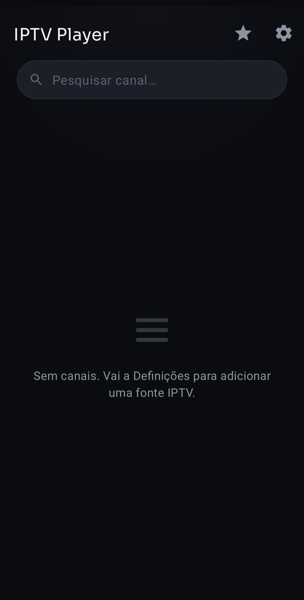
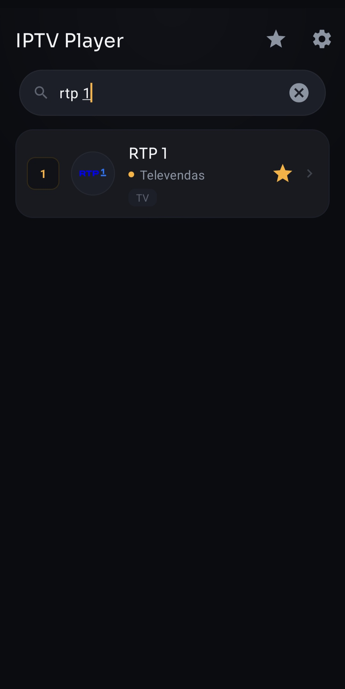
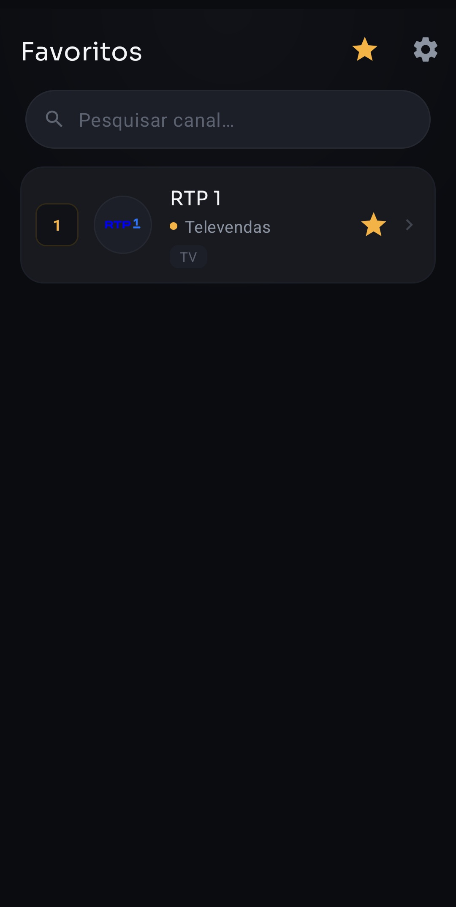
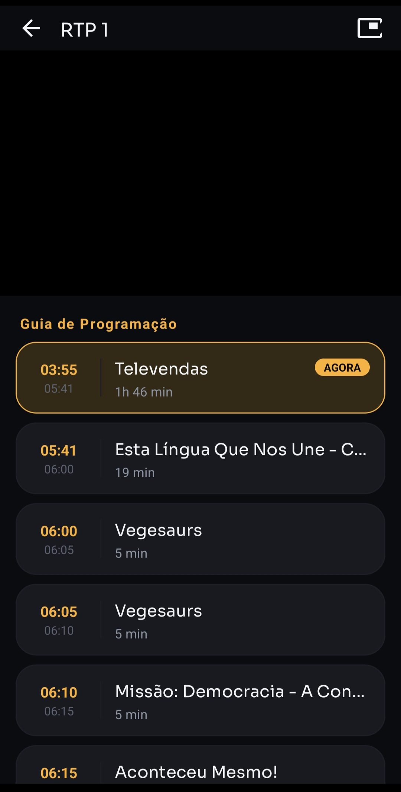

# IPTV Player

> ⚠️ **Projeto desenvolvido com apoio de IA.** Grande parte do código deste repositório foi
> escrita com assistência do Claude (Anthropic) — desde a arquitetura inicial até à generalidade
> das funcionalidades e correções. Tem isso em conta ao avaliar/rever o código.

App Android nativa (Kotlin) para reprodução de listas IPTV (M3U/M3U8, incluindo Xtream Codes),
com guia de programação (EPG/XMLTV), favoritos, e um leitor de vídeo com gestos, Picture-in-Picture
e Ecrã inteiro.

## Screenshots

<table>
  <tr>
    <td align="center"> Ecrã inicial</td>
    <td align="center"> Pesquisa de canais</td>
    <td align="center"> Favoritos</td>
    <td align="center"> Reprodutor + EPG</td>
  </tr>
</table>

## Funcionalidades

- **Fontes IPTV**: adiciona por URL, ficheiro `.m3u`/`.m3u8` local, ou preenchendo apenas
  servidor/utilizador/password de uma conta Xtream Codes (a app constrói os URLs automaticamente).
- **EPG (guia de programação)**: por URL XMLTV, ficheiro local, ou detetado automaticamente a
  partir da própria playlist ou de uma conta Xtream. Suporta ficheiros comprimidos em gzip e
  agendamento de sincronização (sempre / diário / a cada 2 dias / semanal / personalizado).
- **Favoritos**: marca canais e alterna entre a lista completa e os favoritos.
- **Leitor de vídeo**: gestos de arrastar para ajustar brilho/volume, seleção de qualidade por
  canal, Picture-in-Picture, ecrã inteiro com rotação por sensor, buffer de reprodução
  configurável (predefinições ou personalizado).
- **Tema**: claro, escuro, ou seguir o sistema.

## Stack técnica

- Kotlin + View Binding (sem Compose)
- [Media3 (ExoPlayer)](https://developer.android.com/media/media3) para reprodução, com suporte
  a HLS/DASH
- [Room](https://developer.android.com/training/data-storage/room) para persistência local
  (fontes, canais, favoritos, EPG em cache), com migrações reais entre versões do esquema
- OkHttp para pedidos de rede
- Material Components 3, com paleta de cores própria (clara/escura) e tipografia dedicada

## Compilar

1. Abre a pasta do projeto no Android Studio (versão recente recomendada).
2. Deixa o Gradle sincronizar — todas as dependências vêm do Maven Central/Google, não é preciso
   nenhuma chave ou configuração adicional.
3. Corre num dispositivo ou emulador com Android 6.0 (API 23) ou superior.

Não há nenhuma chave de API, credencial ou configuração de assinatura no repositório — a app não
depende de nenhum serviço de terceiros além dos servidores IPTV que o próprio utilizador configurar
dentro da app.

### Build de release (assinada)

Para gerar uma build de release assinada, copia `keystore.properties.example` para
`keystore.properties` (na raiz do projeto) e preenche com os dados da tua keystore. Esse ficheiro
nunca é submetido ao repositório (está no `.gitignore`). Sem ele, a build `release` continua a
compilar normalmente, apenas sem assinatura.

## Notas

- A app permite tráfego HTTP sem encriptação (`usesCleartextTraffic`), porque muitos servidores
  IPTV/Xtream Codes ainda operam apenas em HTTP simples.
- Os dados de configuração (fontes, favoritos, EPG) ficam guardados apenas localmente no
  dispositivo, na base de dados da própria app — nada é enviado para nenhum servidor externo pela
  própria aplicação.

## Licença

[MIT](LICENSE) — © 2026 Tosh
